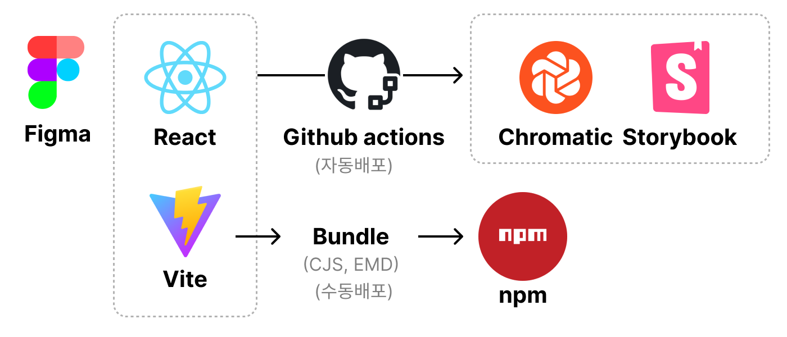
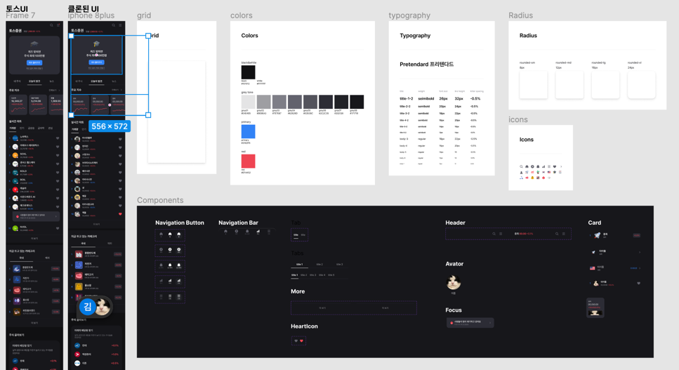
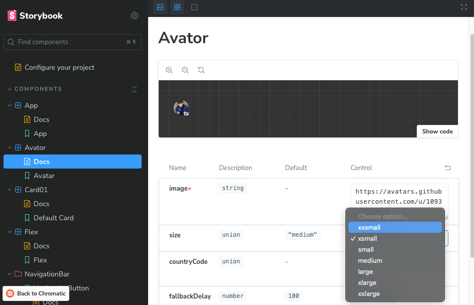
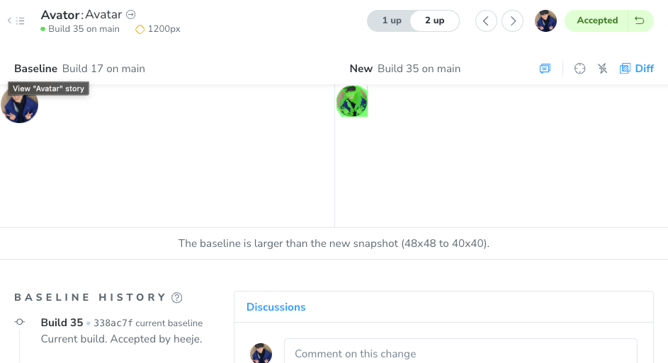
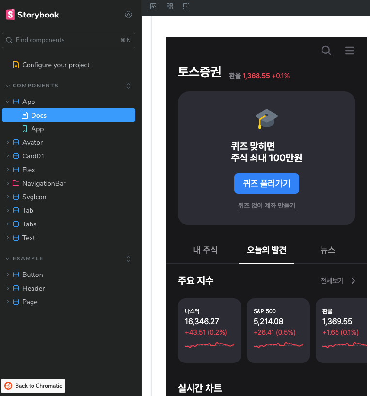

# 토스 주식 클론 스터디

## 개요

토스 주식 UI를 클론디자인/코딩 해보는 스터디

기간 : 2024.05.10 ~ 2024.05.24

## 👩‍👧‍👦 팀원

<table>
 <tr>
    <td align="center"><a href="https://github.com/heisje"></td>
    <td align="center"><a href="https://github.com/ChangJuneKim"></td>
  </tr>
  <tr>
    <td align="center"><a href="https://github.com/heisje"><b>김희제 (개발)</b></td>
    <td align="center"><a href="https://github.com/lea-hwang"><b>박수빈 (디자이너)</b></td>
  </tr>
</table>

## 목표

1. 디자이너&개발자가 실무에 적용가능한 쉽고 편한 협업방안을 찾아보기.
2. 1번을 위해, 토스 주식의 UI를 디자인시스템화 후 구현하기

## 배운 점

- Figma Devtools로 빠른 UI개발
- Figma Plugin을 통한 디자인 토큰 빠른 추출
- Storybook chromatic을 사용해 디자이너 UI현황 파악
- Storybook autoDocs를 활용한 개발자와 협업
- SVG Sprite로 성능과 편의성을 잡은 아이콘 사용
- 디자인시스템 기반 체계화된 UI개발
- Github-workflow를 통한 자동화 배포
- Bundler 지식

## 기술스택

협업도구: Figma, 스토리북, 스토리북 크로마틱, Notion

프론트엔드 및 개발: React, Vite, TypeScript, Storybook, StyledComponent, Github-WorkFlow

### 아키텍처

# 구현 상세

## 1. 디자인시스템 구체화

토스 모바일 UI를 Figma를 통해 디자인시스템을 제작함. 부족하거나 숨겨진 부분은 당근 디자인시스템에서 해답을 얻음.

## 2. 디자인 시스템 추출

### 2-0. UI 개발 

**Figma Devtools**를 사용하여 CSS추출. Anima등 플러그인을 사용해보았으나, 자동완성 부분에서 기본 피그마 시스템이 더 좋은 성능을 보여줌.

### 2-1. 컬러 토큰 수집 (플러그인)

사용한
플러그인 : [https://www.figma.com/community/plugin/857997781988109369/colors-to-code](https://www.figma.com/community/plugin/857997781988109369/colors-to-code)

### 2-2. 아이콘 수집 (플러그인)

아이콘을 Sprite형식(묶음)으로 가져와서 성능과 편의 둘 다 챙길 수 있었다. 다만 색이 지정되지 않거나 관리하기 어려운 이슈가 있었다.

제작하며 작성한 글: [https://heisje.site/posts/react-svgsprite](https://heisje.site/posts/react-svgsprite)

이슈 : [https://heisje.site/posts/react-svgspritebug](https://heisje.site/posts/react-svgspritebug)

사용한
플러그인 : [https://www.figma.com/community/plugin/814345141907543603/svg-export](https://www.figma.com/community/plugin/814345141907543603/svg-export)

### 2-3. Typography 수집 (플러그인)

사용한
플러그인 : [https://www.figma.com/community/plugin/1143791863042221668/global-style-to-code](https://www.figma.com/community/plugin/1143791863042221668/global-style-to-code)

## 3. 개발

디자인시스템기반 컴포넌트 개발. 타입을 잘 지정해두니 AutoDocs기능이 활용이 쉬웠다.  

### 3-1. 자동화 배포

github-workflow를 사용해 자동배포를 구현했다.

chromatic으로 배포되어 디자이너는 쉽게 컴포넌트 단위의 변경사항을 확인해볼 수 있게 했다. 추가적으로 시각적 회귀테스트를 도입하여 어떤 점이 변경되었는지 쉽게 확인할 수 있게 만들었다.

**시각적 회귀 테스트가 반영된 컴포넌트 확인**

## 4. 완성

# 회고

- npm으로 배포해보며 Rollup과 Vite를 활용한 번들러 지식도 얻을 수 있었다.
- 로직을 많이 배제하여 시간 안에 구현했다. 체계화된 UI개발이 얼마나 어려운지도 깨달았다. 다양한 것을 실험해보며, 프로젝트 기간 2주 중 1.5주에 프로젝트 세팅에만 시간을 보냈다. UI구현은 단 3일..
- npm으로 배포 후 reactNative에서 구현해보려했지만, 못해서 아쉽다.
- 다양한 디바이스 환경을 고려하는 어려움을 이해할 수 있었다.